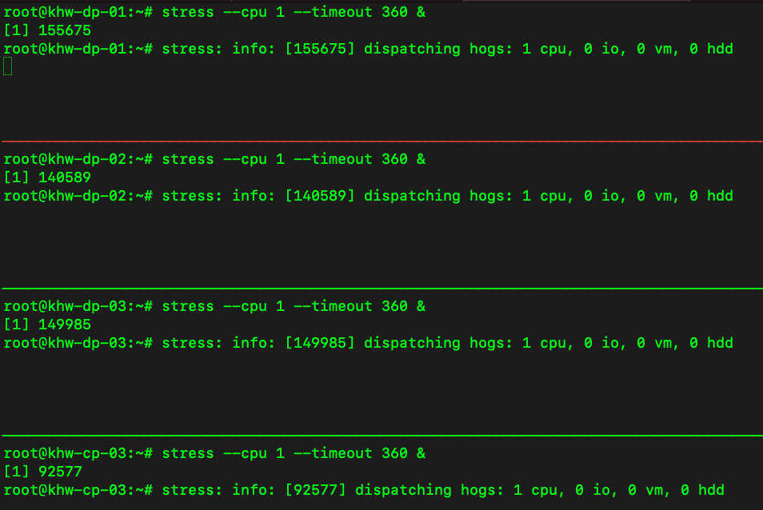
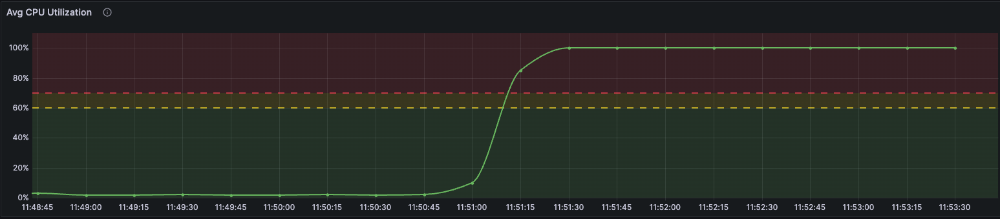
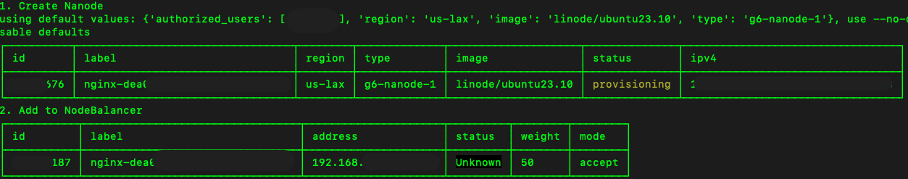
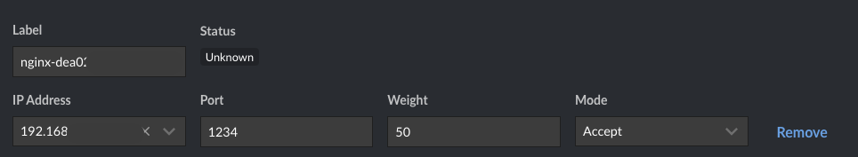

Autoescalado para Linodes detrás de un NodeBalancer, usando Prometheus

# Prerequisitos

- Linode(s) con:
    1. [Prometheus](https://www.linode.com/docs/guides/how-to-install-prometheus-and-grafana-on-ubuntu/#how-to-download-and-install-prometheus)
    1. [AlertManager](https://prometheus.io/docs/alerting/latest/alertmanager/)
    1. [AlertManager executor](https://github.com/imgix/prometheus-am-executor)
    1. [Linode CLI](https://www.linode.com/docs/products/tools/cli/get-started/#installing-the-linode-cli)
    1. [Grafana](https://www.linode.com/docs/guides/how-to-install-prometheus-and-grafana-on-ubuntu/#how-to-install-and-deploy-the-grafana-server) (opcional)
- Node Balancer con:
    1. [Configuracion de nodos backend](https://www.linode.com/docs/products/networking/nodebalancers/guides/backends/) (Nanodes)
- Nanodes con:
    1. [NodeExporter](https://www.linode.com/docs/guides/how-to-install-prometheus-and-grafana-on-ubuntu/#how-to-install-and-configure-node-exporter-on-the-client)
- API Token con
    1. [Permisos](https://www.linode.com/docs/products/tools/api/get-started/#get-an-access-token): Events: read-only, Linodes: read-only, IPs: read-only

# Pasos
## 1. Configuración de Prometheus ([prometheus.yml](prometheus.yml)) 

Una vez instalado Prometheus, creamos la configuración necesaria. En primer lugar definimos la dirección donde encontrará el _AlertManager_. 

```yml
alerting:
  alertmanagers:
    - static_configs:
        - targets:
            - {IP o Reverse DNS	de Alert Manager}:{puerto}
```

Después especificamos la fuente de las reglas que vamos a utilizar.
```yml
rule_files:
    - rules.yml
```


Posteriormente definimos [el apartado de _scrape_configs_]( https://github.com/prometheus/prometheus/blob/release-2.47/documentation/examples/prometheus-linode.yml), en donde especificaremos el API token de Linode:


 ```yml
 scrape_configs:
  # Identificar los nanodes corriendo para hacer 'scrape'.
  - job_name: "linode"
    linode_sd_configs:
      - authorization:
          credentials: "{API token}"
 ```

 En la configuración del reetiquetado definimos la etiqueta que se usará para seleccionar los nodos a monitorear:

 ```yml
     relabel_configs:
      # Monitorear solo los nanodes que con la etiqueta 'X'.
      - source_labels: [__meta_linode_tags]
        regex: ".*,{X},.*"
        action: keep

      # Usar la IPv6 publica para analizar los nodos. Esta se obtiene de la metadata de la instancia, y se pasa como parametro usando $1. El puerto corresponde a lo configurado en NodeExporter
      - source_labels: [__meta_linode_public_ipv6]
        target_label: __address__
        replacement: "[$1]:{puerto}"

      # Usar la etiquta de Linode para identificar la instancia
      - source_labels: [__meta_linode_instance_label]
        action: replace
        target_label: instance
 ```
 
## 2. Reglas ([rules.yml](rules.yml))

 Para este ejercicio se requieren dos reglas: la [definición de la alerta](https://prometheus.io/docs/prometheus/latest/configuration/alerting_rules/) con la que decidiremos agregar Nanodes de backend (_"scale out"_)

 ```yml
   - alert: HighLoad
    # Condición de ejecución; Promedio de CPU de todos los nodos > al 70% por 5m
    expr: avg_cpu_load5 > 0.7
    for: 5m
    labels:
      severity: 'critical'
    annotations:
      summary: "Instancias saturadas > 5m"
      description: "Instancias del job {{ $labels.job }} han estado saturadas por mas de 5 minutos. ({{humanizePercentage .Value }})"

 ```

 y la [serie de tiempo](https://prometheus.io/docs/prometheus/latest/configuration/recording_rules/#defining-recording-rules) que usamos como base para determinar si es necesario actuar.

 ```yml
 # Sumarización de datos en una nueva serie
- name: avg-data
  rules:
  - record: avg_cpu_load5
    expr: avg(1- (irate(node_cpu_seconds_total{mode="idle"}[5m]) / on(instance) group_left sum by (instance)((irate(node_cpu_seconds_total[5m])))))

 ```
## 3. Configuracion de alert manager ([alertManager.yml](alertManager.yml))

Es necesario indicarle al _AlertManager_ hacia donde enviar la información de las alertas que se generen; en este caso se hace por medio de webhooks. La dirección y el puerto corresponden a lo que se configure para el _Alert Manager Executor_. 

```yml
route:
  group_by: ['alertname']
  group_wait: 30s
  group_interval: 5m
  repeat_interval: 1h
  receiver: 'web.hook'
receivers:
  - name: 'web.hook'
    webhook_configs:
      - url: 'http://{IP o Reverse DNS de Linode}:{puerto}'
inhibit_rules:
  - source_match:
      severity: 'critical'
    target_match:
      severity: 'warning'
    equal: ['alertname', 'dev', 'instance']
```

## 4. Configuracion del Alert Manager Executor ([executor.yml](executor.yml)) 

El _executor_ y _alert manager_ se comunican a través de webhooks. Aqui se define el puerto en donde estará escuchando, asi como la acción a ejecutar (_cmd_) si se cumple la condición (_match\_labels_).

```yml
listen_address: ":{puerto}"
verbose: true
commands:
  - cmd: /path/to/scaleOut.sh
    # Ejecutar el script solamente para las alertas con las siguientes etiquetas
    match_labels:
      "alertname": "HighLoad"
    notify_on_failure: false
    resolved_signal: SIGUSR1
```

 ## 5. Script para agregar Nanodes ([scaleOut.sh](scaleOut.sh))

El script que corre el executor se compone de dos pasos. Primero se crea el nanode, generando una etiqueta aleatoria para identificarlo. 

```bash
# Definir una etiqueta aleatoria para el Nanode
LABEL="nginx-$(cat /proc/sys/kernel/random/uuid | head -c 25)"
# Crear Nanode
lin linodes create --root_pass $(openssl rand --base64 32) --tags khw,autoscale --private_ip true --label $LABEL
```

Se utilizan los parametros de la [configuracion por defecto](https://www.linode.com/docs/products/tools/cli/guides/install/#interactive-configuration) del CLI de Linode para el tamaño (Nanode) y la región, que debe ser la misma del NodeBalancer. Es posible especificar configuración adicional por medio de [la metadata](https://www.linode.com/docs/products/compute/compute-instances/guides/metadata/?tabs=linode-cli%2Cmacos
) o usando [StackScripts](https://www.linode.com/docs/products/tools/stackscripts/).


Por último se agrega la instancia al NodeBalancer existente

```bash
NBID={Id del NodeBalancer}
CFGID={Id de la configuracion}
INTERNAL_IP=$(lin linodes ls --format label,ipv4 --text --delimiter ' ' | grep $LABEL | cut -f 3 -d ' ')

# Agregar el Nanode a la configuración del NodeBalancer
lin nodebalancers node-create --address $INTERNAL_IP:{puerto} --label $LABEL $NBID $CFGID
```


# Validación

## 1. Simular Carga

Para probar de manera simple, usamos el comando stress, indicando que corra por 6 minutos

```bash
stress --cpu 1 --timeout 360 &
```

Esto lo hacemos de manera simultánea para los Linodes monitoreados (cuatro, en este ejemplo), con el fin de superar el promedio requerido por la alerta (70% durante 5 minutos).



Usando Grafana, podemos monitorear el incremento de carga



La alerta se dispara al cumplirse la condición, y el _alert manager executor_ la procesa



creando el Nanode, y agregándolo a la configuración del NodeBalancer

